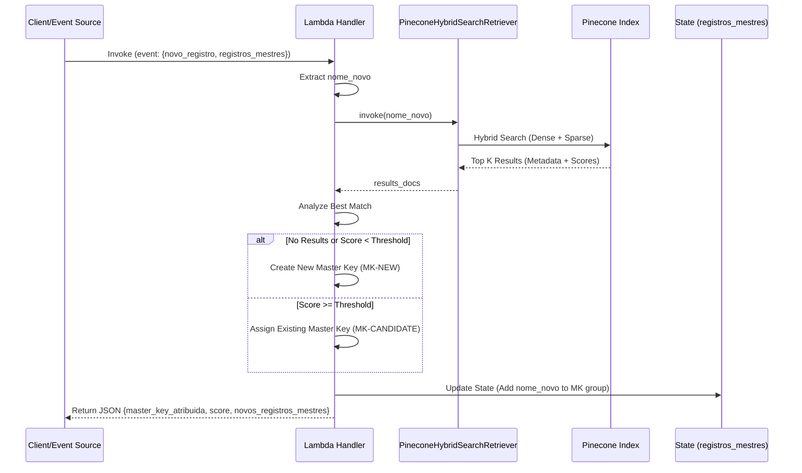

# py-data-medical-embeddings

Pinecone
pcsk_3ervVL_RZWUrcV1m9gCU3M88n9maAj5R4hsACaH9ojfXxRYNW6W9ojnJrwzsNKvPo2N1G6

API-Key
healthcare-development
pcsk_5rpHZv_LeQCoVjy2CiLPK1jivU2kUoQPmYewByVorxiKZL8AR78mKBAREZtvvx5uXVHy2E


**Objetivo**

Criar uma base vetorial no Pinecone a partir de arquivos CSV envolve algumas etapas essenciais: configuração, leitura de dados, geração de embeddings e o upsert (inserção) no índice.

O código a seguir utiliza o Pandas para ler o CSV e a OpenAI para gerar os vetores, uma combinação padrão e eficiente.

⚠️ Observação sobre o Plano Gratuito: O plano gratuito da Pinecone permite apenas um índice e tem um limite de 50.000 vetores. Certifique-se de que sua base de dados de exames não exceda esse limite, e use um nome de índice que não esteja em uso se você já tiver um.

**Pré-requisitos e Instalação**

Você precisará instalar as seguintes bibliotecas:

```console
pip install pandas pinecone-client openai
```

**Código Python para Criação do Índice**

Este script fará a leitura do arquivo fleury-db.csv, gerará os embeddings e fará o upsert no Pinecone.

**Como Executar o Script**

Configure as Chaves: Crie as variáveis de ambiente PINECONE_API_KEY e OPENAI_API_KEY no seu terminal ou preencha as strings SUA_CHAVE... no topo do código.

Ajuste as Colunas: Revise as linhas que definem ID_COLUMN e, principalmente, a criação da coluna df['TEXT_TO_EMBED']. Você deve ajustar os nomes das colunas (METODO, TIPO_COLETA, etc.) para corresponderem exatamente aos cabeçalhos do seu arquivo fleury-db.csv.

```console
python seu_script_de_ingestao.py
```

**Simulação da Lambda de Atribuição**

O script `py-analysis-semantic-langchain.py` contém uma simulação de uma função AWS Lambda (`lambda_handler_pinecone_retriever`) responsável por atribuir uma "Master Key" (MK) a novos registros de exames.

**Funcionamento:**

1.  **Entrada:** Recebe um evento contendo o novo registro (`novo_registro`) e o estado atual dos registros mestres (`registros_mestres`).
2.  **Busca Híbrida:** Utiliza o `PineconeHybridSearchRetriever` para buscar exames semelhantes no índice Pinecone. A busca híbrida combina:
    *   **Busca Densa (Semântica):** Usando embeddings da OpenAI (`text-embedding-3-small`) para entender o significado do termo.
    *   **Busca Esparsa (Palavras-chave):** Usando BM25 para correspondência exata de termos importantes.
3.  **Decisão:**
    *   Se o score de similaridade do melhor resultado for maior ou igual ao `DECISION_THRESHOLD` (0.85), atribui a MK existente.
    *   Caso contrário, cria uma nova MK.
4.  **Atualização de Estado:** Retorna a MK atribuída e a lista de registros mestres atualizada.

**Diagrama de Sequência:**

